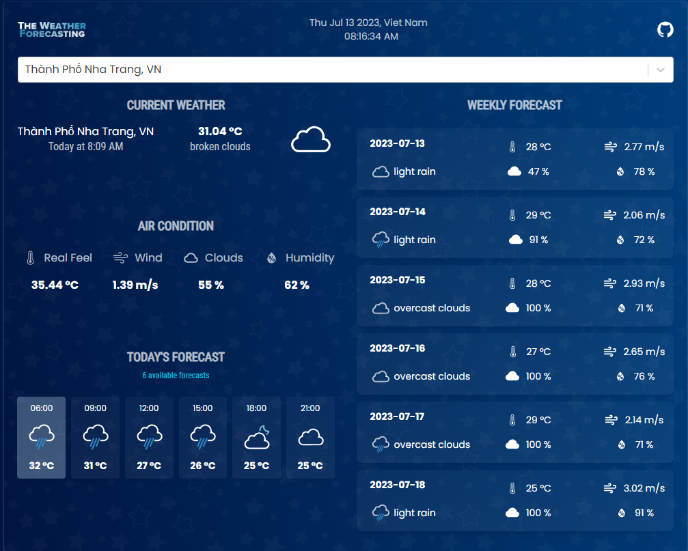

# [Vite](https://vitejs.dev/) + [React](https://reactjs.org/) + [TypeScript](https://www.typescriptlang.org/)

This app base on this layout and feature from [this app](https://the-weather-forecasting.netlify.app) user can search locations by city name and observe the weather for the next 5-6 days and 3 hour interval.

## This setup includes

- [vite](https://vitejs.dev/)
- [eslint](https://eslint.org/), [typescript-eslint](https://typescript-eslint.io/), [eslint-airbnb-config](https://github.com/airbnb/javascript), [prettier](https://prettier.io/)
- [vitest](https://vitest.dev/), [jsdom](https://github.com/jsdom/jsdom), [@testing-library](https://testing-library.com/)
- [react-router v6](https://reactrouter.com/en/main)

## ⚡ Install

- `yarn`

## 📙 Used libraries

- [Tailwind](https://tailwindcss.com/)
- [React 18](https://react.dev/blog/2022/03/29/react-v18)
- [Scss module](https://create-react-app.dev/docs/adding-a-css-modules-stylesheet/) and [Emotion](https://emotion.sh/docs/introduction)
- [React select](https://react-select.com/)

## References

- <https://markus.oberlehner.net/blog/using-testing-library-jest-dom-with-vitest/>
- <https://testing-library.com/docs/queries/about#priority>
- <https://kentcdodds.com/blog/common-mistakes-with-react-testing-library>

## 💻 Live Demo

<https://vercel.com/nguyenkhoi2806/weather-app-react-vite>
